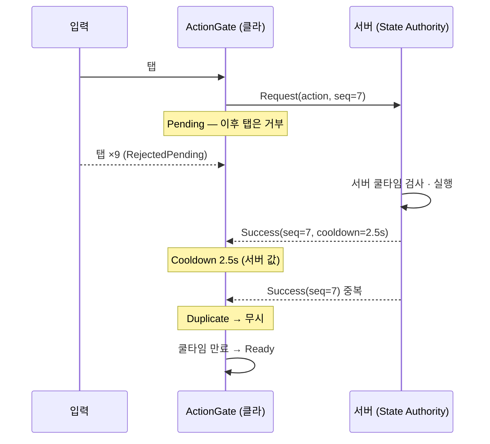

# unity-authority-request


**서버 응답을 권위로 두는 클라이언트 패턴 4종** — 응답 게이트 · 늦은 입장 스냅샷 · 멱등 구매 · 그랩 소유권 판정.

라이브 VR 멀티플레이 게임 개발 중 해결한 문제를 회사 코드 없이 범용으로 다시 구현했습니다.

**이 저장소는 기능 데모가 아니라 코드 샘플입니다.** 판정 로직은 전부 UnityEngine 참조가 없는 C# 어셈블리에 있고, 119개 EditMode 테스트가 동작을 고정합니다. 데모 씬은 확인용으로만 두었습니다.

## 읽는 순서

코드를 보러 오셨다면 이 순서를 권합니다. 전부 `Packages/com.jongreul.authority-request/` 아래에 있습니다.

| # | 파일 | 무엇을 보면 되는지 |
|---|---|---|
| 1 | `Runtime/Core/Gate/ActionGate.cs` | 상태머신 하나로 연타·중복 응답·역전 응답·타임아웃을 어떻게 정리하는지. 시퀀스 번호가 핵심 |
| 2 | `Tests/EditMode/Gate/ActionGateTests.cs` | 위 클래스의 동작 명세 30개. 테스트 이름만 읽어도 설계 의도가 보이게 썼습니다 |
| 3 | `Tests/EditMode/Gate/MockGateServerTests.cs` | 지연·지터·실패·중복을 섞은 3,000회 혼돈 실행에서 지키는 불변식 |
| 4 | `Runtime/Core/LateJoin/SnapshotRequester.cs` | 늦은 입장자가 스스로 요청하고, 버전 빈칸을 유예했다가 재요청하는 흐름 |
| 5 | `Runtime/Core/Purchase/PurchaseLedger.cs` · `IdempotencyCache.cs` | 같은 요청 ID를 두 번 받아도 한 번만 차감하는 서버 쪽 장부 |
| 6 | `Runtime/Core/Grab/GrabArbiter.cs` | 여러 명이 같은 물체를 잡을 때 선착 소유·세대 번호·서버 정지 판정 |
| 7 | `Runtime/Fusion/PurchaseAuthority.cs` · `GrabAuthority.cs` | 위 순수 로직을 Photon Fusion 2의 RPC와 `[Networked]`에 얹는 어댑터 |

---

## 이 저장소가 푸는 문제

| 상황 | 흔한 구현 | 생기는 일 |
|---|---|---|
| 스킬·구매 버튼 연타 | 클라 디바운스(수백 ms) | 지연이 디바운스보다 길면 이중 실행. 쿨타임을 클라 상수로 그리면 서버 값과 어긋남 |
| 늦게 들어온 플레이어 | 보내는 쪽이 "새 플레이어가 생길 때마다" 전체 상태를 쏨 | 받는 쪽이 아직 준비 전이면 유실, 준비 후 다시 쏘면 중복 |
| 상점 구매 | 클라가 가격을 들고 요청 | 가격 조작, 응답 유실 뒤 재전송으로 이중 차감 |
| 여러 명이 같은 물체를 잡음 | 각 클라가 잡은 즉시 소유 | 소유권 충돌, 놓은 뒤 멈춘 위치가 피어마다 다름 |

네 가지 모두 답은 같다. **판정은 서버가 하고, 클라이언트는 서버 응답이 올 때까지 결과를 확정하지 않는다.** 이 저장소는 그 원칙을 재사용 가능한 부품으로 나눠 테스트로 고정한 것이다.

## 설계

### 구성 요소

| 모듈 | 클래스 | 책임 |
|---|---|---|
| **A. 응답 게이트** | `ActionGate` | `Ready → Pending → Cooldown → Ready` 상태머신. Pending·Cooldown 중 입력 거부, 쿨타임 길이는 서버 응답 값만 사용, 단조 증가 시퀀스로 중복·역전·타임아웃 뒤 늦은 응답을 버림 |
| | `IGateServer` / `MockGateServer` | 전송 계층 인터페이스 / 지연·지터·실패·중복 응답을 흉내 내는 가짜 서버(서버 쪽 쿨타임 판정 포함) |
| | `IClock` / `ManualClock` / `UnityClock` | 주입 가능한 시계. 테스트는 시간을 손으로 돌린다 |
| **B. 늦은 입장** | `SnapshotProvider<T>` | 서버 상태 보관. 변경마다 버전 +1, 요청이 오면 **기본값과 다른 슬롯만** 스냅샷으로 응답 |
| | `SnapshotRequester<T>` | 받는 쪽이 준비되면 스스로 요청. 요청 중 도착한 변경은 버퍼 후 버전 순서로 이어 붙임. 버전 빈칸은 유예(0.3 s) 동안 기다렸다 메우고, 안 메워지면(유실) 재요청. 재요청은 멱등, 요청 타임아웃 시 재시도 |
| | `MockSnapshotNetwork<T>` | 메시지별 지연·지터가 있는 서버 1 : 클라 N 가짜 네트워크 |
| **C. 멱등 구매** | `IdempotencyCache<TKey,TResult>` | (플레이어, 요청 ID) → 결과를 TTL 동안 보관. 먼저 저장된 결과 우선, 용량 초과 시 오래된 것부터 |
| | `PurchaseLedger` | 서버 가격표로 판정·차감. 같은 요청 ID는 이전 결과 재응답, 다른 아이템으로 재사용하면 충돌 |
| | `PurchaseAuthority` · `PurchaseClient` (Fusion 2) | RPC는 `(아이템, 요청 ID)`만. State Authority만 판정, 잔고·보유는 `[Networked]`로 복제, 결과는 대상 RPC로 요청자에게만 |
| **D. 그랩 판정** | `GrabArbiter` | 선착 1명 소유, 소유자만 릴리즈, 서버 물리 정지 판정 → 전 피어 동일 정지 자세. 세대 번호로 늦은 보고 무시 |
| | `HandInventoryPolicy` | 양손 보유 제한(기본 1개). 한도 초과 시 거부 / 먼저 쥔 것 놓기. 그랩 금지 플래그 |
| | `GrabbableReplica` | 피어 한 명의 표시 상태. 내 손이면 손 자세, 남이 들면 보간, 정지 방송이면 정확히 그 자세 |
| | `GrabAuthority` · `GrabbableView` (Fusion 2) | 판정 결과를 `[Networked]` 딕셔너리 하나로 복제(늦은 입장자도 같은 상태) |

### 어셈블리

```
Jongreul.AuthorityRequest.Core     순수 C# (noEngineReferences) — 모든 판정 로직. UnityEngine 없이 테스트
Jongreul.AuthorityRequest          Unity 어댑터 — UnityClock, PoseData↔Transform, PriceTableAsset
Jongreul.AuthorityRequest.Fusion   Fusion 2 어댑터 — defineConstraints: FUSION2 (SDK가 없으면 컴파일 대상에서 빠짐)
```

### 데이터 흐름



구매도 같은 흐름이다. `seq` 자리에 `requestId`가 들어가고, 서버가 `(플레이어, requestId)`로 결과를 기억해 재전송에도 한 번만 차감한다.

## 확인 방법

1. Unity **6000.3.9f1**(6.3 LTS)로 연다.
2. `Assets/Demos/Gate/GateDemo.unity` → Play.
   - **Mash ×10**을 누르거나 Skill 버튼을 연타 → 아래 통계가 `Taps 10 · Requests sent 1 · Server executed 1`.
   - 버튼 색: 초록 Ready → 노랑 서버 대기(시퀀스 번호) → 회색 쿨타임(서버가 준 값, 막대가 줄어듦).
   - **Bypass gate**를 켜고 연타 → 매 탭이 요청이 되고 로그에 `SERVER: rejected (server-cooldown)`가 쌓인다. 게이트가 없어도 서버 판정이 이중 실행을 막는다는 것, 대신 요청이 10배라는 것이 보인다.
   - Latency·Jitter·Failure·Duplicate 슬라이더로 나쁜 네트워크를 만들어 본다. Duplicate를 올리면 `Ignored responses`가 늘지만 실행은 늘지 않는다.
3. 테스트: **Window › General › Test Runner** → EditMode 전체 실행, PlayMode 전체 실행.

### Fusion 2 샘플 (선택)

Photon Fusion SDK는 라이선스 때문에 저장소에 넣지 않았다.

1. [Photon Fusion 2 SDK](https://doc.photonengine.com/fusion/current/getting-started/sdk-download)를 import하면 SDK 설치기가 `FUSION2` 정의를 추가한다. 어댑터는 Fusion 2.0.6 + Unity 6000.0.58f2에서 PlayMode로 검증했다. 2.0.6의 에디터 코드는 Unity 6000.3에서 예외가 나므로, 6000.3에서 돌리려면 6.3을 지원하는 SDK가 필요하다.
2. `Assets/Photon/Fusion/Resources/NetworkProjectConfig.fusion`의 `AssembliesToWeave`에 `Jongreul.AuthorityRequest.Fusion`을 추가한다(`[Networked]`·RPC 위빙 대상).
3. **Tools › Authority Request › Rebuild Fusion Demo Assets** → 가격표·네트워크 프리팹 생성.
4. PlayMode `PurchaseSingleModeTests`·`GrabSingleModeTests` 실행 — Fusion **Single 모드**라 App ID 없이 실제 RPC·`[Networked]`·서버 물리 경로를 탄다.
5. 2피어(Host + Client)로 돌리려면 Photon App ID가 필요하다. `PhotonAppSettings`는 커밋하지 않는다(gitignore).

> 로컬에 SDK를 넣으면 `ProjectSettings.asset`에 `FUSION2`가 들어간다. 이것이 커밋되면 SDK 없는 CI가 Fusion 어셈블리를 컴파일하려다 실패한다. 저장소 루트에서 한 번:
> ```
> git config filter.strip-fusion.clean "python tools/git-filters/strip-fusion-defines.py"
> git config filter.strip-fusion.smudge cat
> ```

## 검증

| 구분 | 수 | 내용 |
|---|---|---|
| EditMode (Core) | **119** | 게이트 38 · 늦은 입장 24 · 멱등 구매 28 · 그랩 29 — 전부 UnityEngine 무의존 어셈블리 |
| PlayMode (데모 흐름) | **2** | 실제 프레임 루프에서 연타 10회 → 요청 1회 / 게이트 우회 시 요청 10회·실행 1회 |
| PlayMode (Fusion, SDK 설치 시) | **2** | Fusion 2.0.6 · Unity 6000.0.58f2 Single 모드에서 통과. 구매: 같은 요청 ID 2회 → 차감 1회·재응답 / 그랩: 잡기 → 한도 초과 거부 → 놓기 → 서버 물리 정지 → 표시 자세 = 서버 정지 자세. Unity 6000.3에서는 SDK 2.0.6 에디터 코드 비호환으로 실행 불가 — [상세](docs/analysis/verification.md#fusion-런타임) · [결과 XML](docs/analysis/fusion-single-mode-unity6000.0.xml) |

위 수치는 로컬 배치 실행 결과다. GitHub Actions 워크플로(`.github/workflows/tests.yml`, GameCI)는 들어 있지만 Unity 라이선스 시크릿을 넣기 전까지 수동 실행으로만 두었다.

대표 불변식 테스트(측정 조건과 결과: [docs/analysis/verification.md](docs/analysis/verification.md)):

- **게이트만으로 이중 실행 방지** — 지연 250 ± 250 ms, 실패 20 %, 중복 응답 30 %에서 20 ms 간격으로 3000회 입력. 서버 쿨타임에 걸려 거절된 요청이 **0건**. 목 서버의 쿨타임 판정이 아니라 게이트가 서버보다 먼저 입력을 여는 일이 없다는 증명이다.
- **게이트 혼돈 실행** — 같은 조건에 응답 타임아웃 350 ms를 더해 중복·지난 응답·타임아웃이 실제로 섞이게 한 뒤, 적용된 응답 시퀀스가 엄격히 증가하는지 본다.
- **늦은 입장 수렴** — 16슬롯에 400회 무작위 변경이 흐르는 동안 7명이 제각기 입장, 지연 150 ± 120 ms. 순서 역전이 실제로 일어났음을 단언하고, 변경이 멈춘 뒤 전원 `Synced`, 버전·슬롯 값이 서버와 일치, 스냅샷은 클라이언트당 2회 이하.
- **빈칸 유예 효과(측정)** — 60초 동안 20 ms마다 변경, 지연 150 ± 120 ms. 빈칸을 보자마자 재요청하면 동기화 유지율 14.1 %·스냅샷 162회, 0.3초 유예를 두면 **99.6 %·스냅샷 1회**.
- **정지 자세 일치** — 세 피어가 서로 다른 보간 상태에 있어도 서버 정지 방송 뒤 자세가 비트 단위로 같다.

## 한계와 다음 단계

- **쿨타임 시작점** — 클라는 응답을 받은 순간부터 센다. 서버보다 편도 지연만큼 늦게 끝나므로 서버보다 먼저 입력을 여는 일은 없지만, 체감 쿨타임이 그만큼 길다. 서버 시각 동기화로 줄일 수 있다.
- **타임아웃 뒤 도착한 성공** — 게이트는 버린다. 서버는 실행했으므로 다음 요청은 서버 쿨타임이 거절한다(안전). Fail 응답에 남은 쿨타임을 실어 클라 표시를 맞추는 것이 다음 단계.
- **빈칸 유예의 대가** — 변경이 실제로 유실되면 유예(0.3 s)만큼 늦게 복구된다. 유예는 채널 지터보다 길게 잡아야 하며, 순서 보장 채널(Fusion reliable RPC)이면 0으로 둬도 된다.
- **멱등 캐시는 메모리** — 서버 재시작·용량 초과 시 보호가 약해진다. 비소모성 아이템은 보유 검사가 한 번 더 막지만, 소모성 재화는 DB 유니크 키(요청 ID)가 필요하다.
- **PlayerRef 재사용** — 샘플은 세션 슬롯 번호를 키로 쓰고, 퇴장 시 잔고·보유 목록·재응답 캐시를 모두 지운다(같은 번호로 들어온 사람이 이전 결과를 받지 않게). 실제 서비스는 계정 ID를 키로 둔다.
- **그랩은 서버 확정** — 클라 예측이 없어 잡는 반응이 왕복 지연만큼 늦다. 예측 후 거절 시 롤백이 다음 단계. 놓을 때 클라가 보낸 위치는 마지막 손 자세에서 0.75 m 안일 때만, 속도는 15 m/s 이하로 잘라서 받는다. 정지는 선속도·각속도·물리 Sleeping과 최소 경과 시간으로 판정한다.
- **Fusion 검증 범위** — Single 모드(피어 1개, Unity 6000.0.58f2)까지 실제 `NetworkRunner`로 검증했다. Host가 스스로 보낸 요청은 `HostMode = SourceIsHostPlayer`로 처리했다(기본값이면 Host 요청의 `info.Source`가 None이 되어 Host 플레이어의 구매가 버려진다). Host + Client 2피어와 Dedicated Server는 App ID가 필요해 아직 돌리지 않았다.
- **2피어 데모** — Photon App ID가 필요해 2피어 GIF는 아직 없다.
- **샘플 위치** — 데모는 UPM `Samples~`가 아니라 이 저장소(호스트 프로젝트)의 `Assets/Demos/`에 있다. 패키지만 가져가는 경우 데모는 따라가지 않는다.

## 관련 포트폴리오

- 포트폴리오(Notion): [강종렬 포트폴리오 2026](https://app.notion.com/p/jongreulk/2026-3d849fd9829281cba738df3134fa9b8a)

---

### English summary

- Four client patterns that keep the **server response authoritative**: response gate, late-join snapshot, idempotent purchase, grab ownership.
- Rebuilt from scratch as a generic Unity package, based on problems solved while shipping a live multiplayer VR game (no company code).
- All decision logic lives in an engine-free C# assembly with 119 EditMode tests, including chaos runs with latency, jitter, duplicates and reordering.
- Photon Fusion 2 adapters (server-authoritative RPCs + `[Networked]` replication) compile only when the SDK is present, so CI runs without it.
- Open `Assets/Demos/Gate/GateDemo.unity` and mash a button: ten taps, one request, one execution.
